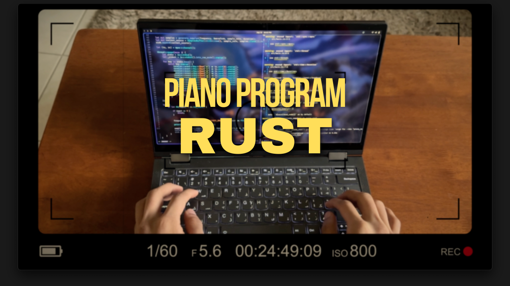

# Piano in Rust (sorta)

A basic project I made with Rust to play sounds at different frequencies.



[Video Link](https://youtu.be/5PoA51DeRQU)

Use the keys a,s,d,f,g,h,j,k,l as your piano keys.

Press 0 to exit, or remap 0 to another key.

Adjust the sleep duration for lesser or more delay when changing sounds.

```rust
sink.play();
        thread::sleep(Duration::from_millis(100)); // here
```
